# **MANUAL DE USUARIO**

Se le solicitará para esta actividad la implementación de un sistema para punto de venta en ensamblador. Este sistema tendrá la capacidad de gestionar el inventario de productos, control de ventas y clientes. Además, se tendrá un módulo de reportería que trabajará sobre los datos almacenados por el sistema y un módulo para carga masiva de datos.

## **Introducción**
___

En esta sección, se brinda una introducción general al sistema de ingreso de productos y realización de ventas. Se enfoca en proporcionar una visión general del propósito del sistema, su importancia y cómo beneficia a los usuarios.

El sistema de ingreso de productos y realización de ventas es una herramienta diseñada para facilitar la administración eficiente de inventario y el proceso de ventas en tu negocio. Con este sistema, podrás registrar y mantener un control preciso de los productos disponibles, así como realizar ventas de manera ágil y generar informes para el análisis de datos.

El objetivo principal del sistema es simplificar y automatizar las tareas relacionadas con el ingreso de productos y la realización de ventas. Al utilizar este sistema, podrás optimizar la gestión de inventario, agilizar el proceso de ventas y obtener informes detallados que te ayudarán a tomar decisiones basadas en datos precisos.

El manual de usuario está dirigido a los empleados de tu negocio que serán responsables de utilizar el sistema. Esto incluye a administradores de tiendas, vendedores y personal encargado del inventario. No se requieren conocimientos técnicos avanzados, ya que el sistema ha sido diseñado para ser intuitivo y fácil de usar.

Este manual de usuario proporciona instrucciones detalladas sobre cómo utilizar el sistema de ingreso de productos y realización de ventas. Cubre todas las funcionalidades principales, incluyendo el ingreso y eliminación de productos, la realización de ventas y la generación de informes. Además, se incluyen consejos útiles y sugerencias para aprovechar al máximo el sistema.

Para facilitar la comprensión del manual, se han utilizado las siguientes convenciones: los términos técnicos y las palabras clave están resaltados en negrita, se utilizan íconos específicos para indicar acciones, advertencias o notas importantes, y las abreviaturas utilizadas en el manual se explican en la sección de glosario al final del documento.

## **Instalación**
___

Para instalar el software de ingreso de productos y realización de ventas en tu sistema, sigue los siguientes pasos:

* Descarga el archivo de instalación desde el sitio web oficial o la fuente confiable.
* Ejecuta el archivo de instalación haciendo doble clic en él.
* Sigue las instrucciones del asistente de instalación para seleccionar el idioma y la ubicación de instalación.
* Acepta los términos y condiciones de la licencia.
* Personaliza las opciones de instalación según tus preferencias.
* Haz clic en "Instalar" para comenzar la instalación.
* Espera a que se complete la instalación. Puede llevar algunos minutos.
* Una vez finalizada la instalación, haz clic en "Finalizar" para cerrar el asistente.

Una vez que hayas completado la instalación, el software estará listo para su uso. Antes de comenzar a utilizarlo, asegúrate de configurar las opciones necesarias, como la creación de una base de datos, la configuración de usuarios y permisos, y la importación de datos existentes si corresponde.

Si encuentras algún problema durante el proceso de instalación o necesitas ayuda adicional, consulta la documentación proporcionada o comunícate con nuestro equipo de soporte técnico.

## **Guía de Uso**
___

En esta sección, se proporciona una guía detallada sobre cómo utilizar el software de ingreso de productos y realización de ventas. Sigue los siguientes pasos para aprovechar al máximo las funcionalidades del sistema:

1. **Ingreso de Productos**

    * Para agregar un producto nuevo al sistema, haz clic en la opción "Ingresar Producto" en el menú principal.
    * Completa los campos requeridos, como el nombre del producto, el precio, la cantidad disponible, etc.
    * Haz clic en el botón "Guardar" para almacenar el producto en la base de datos.
    * Si deseas editar o eliminar un producto existente, selecciona el producto en la lista y elige la opción correspondiente.

2. **Realización de Ventas**

    * Para realizar una venta, selecciona la opción "Realizar Venta" en el menú principal.
    * Agrega los productos que el cliente desea comprar, ingresando la cantidad y seleccionando el producto de la lista.
    * Calcula el total de la venta y muestra el resumen al cliente.
    * Finaliza la venta imprimiendo el recibo o generando una factura electrónica según los requisitos.

3. Generación de Reportes

    * Accede a la sección de "Reportes" en el menú principal para obtener información sobre productos o ventas.
    * Selecciona el tipo de informe que deseas generar, como "Reporte de Productos" o "Reporte de Ventas".
    * Define los parámetros de búsqueda, como el rango de fechas o los criterios de filtrado.
    * Genera el informe y visualízalo en un archivo .htm o en el formato deseado.

4. Eliminación de Productos

    * Si necesitas eliminar un producto del sistema, accede a la opción "Eliminar Producto" en el menú principal.
    * Selecciona el producto que deseas eliminar de la lista y confirma la eliminación.
    * Ten en cuenta que esta acción es irreversible, por lo que debes asegurarte de eliminar el producto correcto.

Asegúrate de explorar todas las funcionalidades del sistema y familiarizarte con los diferentes menús, opciones y características disponibles. Si tienes alguna pregunta o necesitas ayuda adicional, consulta la sección de "Ayuda" del software o ponte en contacto con nuestro equipo de soporte.

Recuerda que esta guía de uso es solo una referencia básica y que el software puede tener características adicionales que no se mencionan aquí. Consulta la documentación proporcionada o comunícate con el soporte técnico para obtener más información sobre las funcionalidades avanzadas.

## **Flujo del proyecto**
___

Al iniciar el proyecto se mostara un mensaje inicial, en el que se encuentran todos los datos correspondientes al autor y a la institucion creadora de dicho proyecto, como se ve a continuacion:

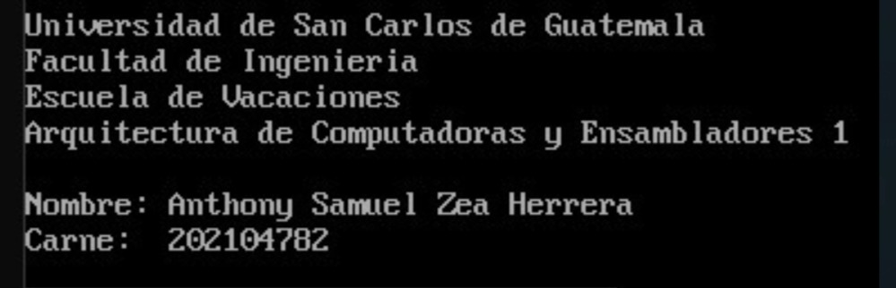

Posterior a esto, el sistema es capaz de analizar correctamente el contenido de un archivo en el que se encuentran las credenciales de lo que pudiera ser el usuario administrador.

El archivo a analizar posee el nombre de "PRA2.CNF", y tiene una estructura similar a esta:

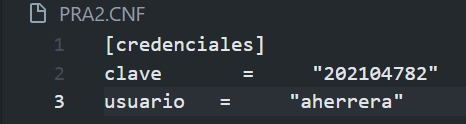

Si las credenciales son correctas y todo marcha bien, el usuario administrador podra ingresar al sistema automáticamente y se mostrara en pantalla cada una de las opciones que presenta el sistema, de lo contrario el programa se cerrara automaticamente al verificar que sus datos no son correctos.

### **Ingreso Válido**
___

Al ingresar al sistema se mostrara un menú como el siguiente:

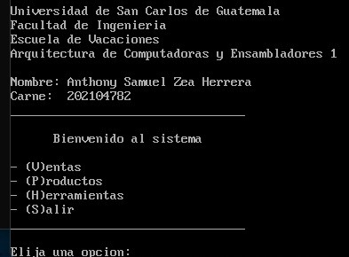

### **Menu Principal**
___

Dentro del menu principal se encuentran las siguientes funciones, las cuales el usuario debera presionar la letra que se le indica en cada una de las opciones, siendo estas de la siguiente manera:

- **(V):** Al presionar la letra V, el usuario podra ingresar al menu de ventas, en el que el usuario puede realizar cualquier venta con sus respectivos campos y menus, y se visualiza asi:
    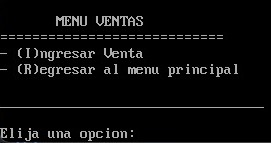

- **(P):** Al presionar la letra P, el usuario podra ingresar al menu de productos, en el que el usuario puede realizar cualquier opcion dentro de este menu, como ingreso de un producto nuevo, visualizacion de los productos ya ingresados, o la eliminacion de algun producto ya ingresado:
    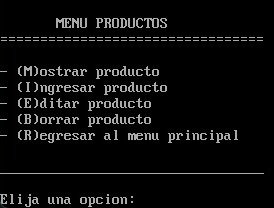

- **(H):** Al presionar la letra H, el usuario podra ingresar al menu de herramientas, en el que el usuario puede realizar cualquier opcion dentro de este menu, en lo que en general es la creacion de cada uno de los reportes que el sistema es capaz de hacer con la informacion que el usuario ha proporcionado:
    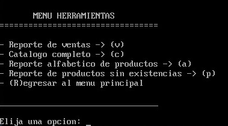

### **Menu Ventas**
___

Dentro del menu ventas se encuentra una unica opcion, la cual es la registro de una venta activa en el proyecto, para lo cual se muestra un menu sencillo, en el que el usuario debera ingresar el codigo del producto y si este existe dentro de los productos registrados, podra ingresar las unidades que quiere vender de ese producto, para que se resten esas unidades de sus existencias

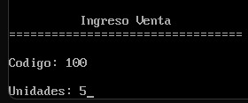

Una vez el usuario ha ingresado el codigo y venta, este menu se volvera a mostrar por si el usuario quisiese realizar otra venta, hasta un máximo de 10 ventas, ya que al sobrepasar este limite se cerrara automaticamente las ventas del sistema y regresara al menu principal y registrara esas 10 ventas.

- NOTA: Si el usuario desea realzizar una unica venta o 2 o 3 o en el rango de 1 a 10, podra escribir la palabra clave "fin", y el sistema automaticamente registrara esa unica venta y regresara al menu principal

### **Menu Productos**
___

Dentro del menu de productos se encuentran las opciones anteriormente vistas:
- Ingreso de productos
- Borrar producto
- Mostrar producto

En el momento que el usuario presiona la letra "I", el sistema ingresara al menu de ingreso de un producto, en el que el usuario debera ingresar los siguientes campos:
- codigo
- descripcion
- precio
- unidades

Una vez haya escrito cada uno de estos campos automaticamente se registraran esos datos como un nuevo producto en el sistema, que podra visualizarse en cada uno de los reportes

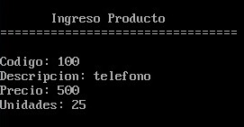

Posteriormente si el usuario accede a la opcion de Borrar un producto, se mostrara un menu sencillo, en el que el usuario unicamente debera ingresar el codigo del producto que desea eliminar, y si este existe dentro del sistema lo eliminara

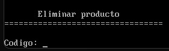

Por ultimo, si el usuario seleccionara la opcion de mostrar productos, automaticamente se mostrara un submenu que mostrara el codigo y la descripcion de todos los productos que han sido registrados en el sistema, y de esta manera cualquier usuario podra visualizar que productos han sido registrados con exito

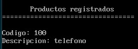

Si el usuario desea salir del menu de productos basta con que presione la letra R, para regresar al menu principal

### **Menu Herramientas**
___

Al ingresar a este menu, no es de gran ciencia el analisis de este menu, ya que la unica funcionalidad de este, es la generacion de los reportes que el sistema es capaz de generar en el sistema, basta con presionar la letra que indica cada uno de los bloques u opciones del menu:

- (v): Si se presiona la letra V, automaticamente se generara en la carpeta raiz un archivo llamado "REP.TXT", el cual contiene las ventas que se han hecho en el sistema, registrando la fecha y la hora de la generacion del reporte, ademas de la venta con el mayor monto y la venta con el menor monto

- (c): Si se presiona la letra C, automaticamente se generara en la carpeta raiz un archivo llamado ""CATALG.HTM", en el que se encuentra toda la informacion de todos los productos que han sido registrados en el sistema, de manera organizada con fecha y hora

- (a): Si se presiona la letra A, automaticamente se generara un archivo en la carpeta raiz, con el nombre de "ABC.HTM", en el que se encontraran todos los productos ingresados pero en orden alfabetico y la cantidad de productos que han sido ingresados con una letra especifica

- (p): Si se presiona la letra P, automaticamente se generara un archivo en la carpeta raiz, con el nombre de "FALTA.HTM", en este archivo se ingresan todos aquellos productos que bien han sido registrados sin ninguna existencia o bien ya sea que al realizar ventas se han quedado sin unidades, por lo tanto se verifican en este reporte

- (R): Al presionar la letra R, simplemente el usuario regresa al menu principal.

### **Ejemplo de visualización de reportes**
___

#### **Reporte de ventas**
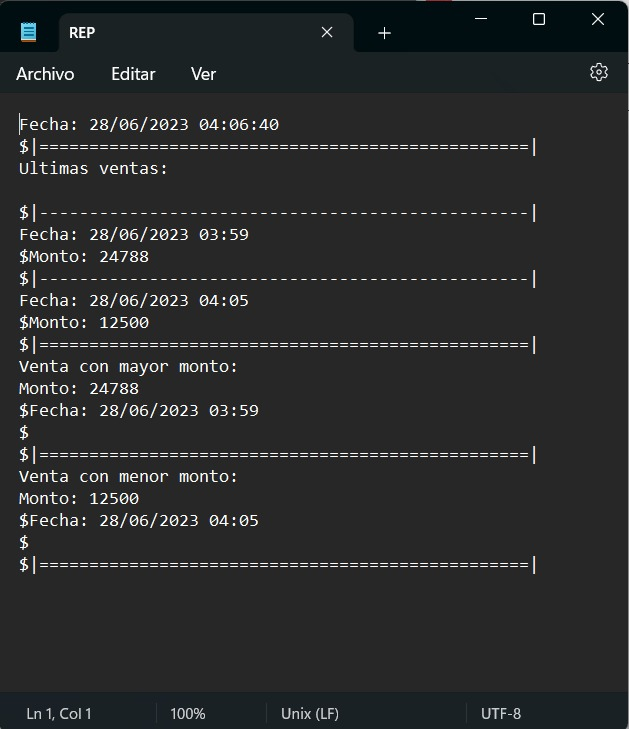

#### **Catalogo de productos**
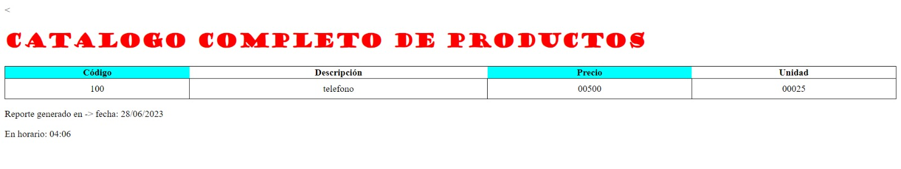

#### **Reporte de productos sin existencias**
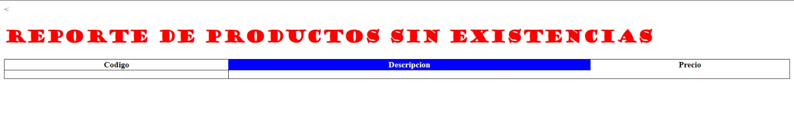

#### **Reporte de productos alfabeticamente**
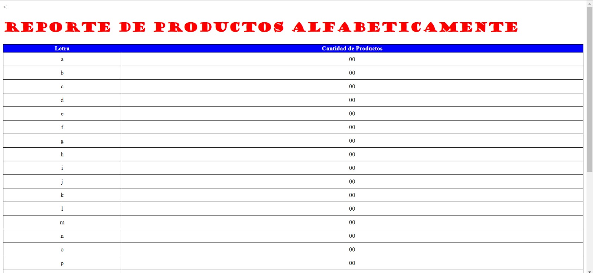